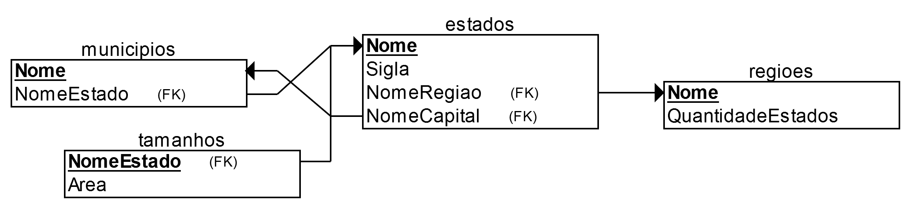

<div align="center">
  <a href="https://telegram.me/SIEGE_BR_bot">
    
  </a>
  <a href="">
    
  </a>
  <a href="https://heroku.com">
    
  </a>
  <div>Sistema Inteligente de Ensino de Geografia para o Telegram</div>
  <sub>
    by
    <a href="https://github.com/micalevisk">Micael Levi</a>
  </sub>
</div>

<!-- ## Atividades do Projeto 
[](https://waffle.io/area/language-latex/metrics)
-->

## Sobre a base de conhecimento em [src/prolog-controller/database](src/prolog-controller/database)

Os fatos disponíveis nos programas dispostos neste diretório são:
> - `regiao(?Nome, ?QuantidadeEstados)`
> - `estado(?Nome, ?Sigla, ?NomeRegiao, ?NomeCapital)`
> - `tamanhos(-EstadosEAreas:list(NomeEstado-Area))`
> - `municipio(?Nome, ?NomeEstado)`

Pensando nos fatos em termos de tabela, as relações de integridade referencial ficam da seguinte forma:



-------------

## Instalação
<div align="center">
  <table align="center">
    <tr align="center">
      <td align="center">
        <b>
          <a href="https://nodejs.org">
            Node.Js v8
          </a>
        </b>
        <div>
           &nbsp; &nbsp; &nbsp; &nbsp; pré-requisito &nbsp; &nbsp; &nbsp; &nbsp;
        </div>
      </td>
      <td align="center">
        <b>clonar este repositório</b>
        <div>
          &nbsp; <kbd>git clone https://github.com/micalevisk/siege-telegram-bot</kbd> &nbsp;
        </div>
      </td>
      <td align="center">
        <b>🙏</b>
        <div>
          &nbsp; &nbsp; <kbd>npm install</kbd> &nbsp; &nbsp;
        </div>
      </td>
      <td align="center">
        <b>pegue o token</b>
        <div>
          &nbsp; &nbsp; com o <a href="http://t.me/BotFather">@BotFather</a> &nbsp; &nbsp;
        </div>
      </td>
    </tr>
  </table>
</div>

Crie um arquivo de nome **`.env`** do diretório raiz com o seguinte conteúdo:
```
BOT_TOKEN = <SEU TOKEN AQUI>
```
E execute **`npm start`** no terminal

## ~~DEMO~~
Entre em contato com o bot [@SIEGE_BR_bot](http://t.me/SIEGE_BR_bot) no aplicativo Telegram

# Perguntas que serão respondidas
> - as perguntas listadas a seguir contém apenas palavras-chave que o bot entenderá _(case insensitive)_
> - algumas palavras podem ser substituídas por seus sinônimos que estão listados em [sinonimos.js](src/brain/grammar/sinonimos.js)
> - termos entre colchetes indicam que estes são opcionais; a barra indica uma alternativa
> - os substantivos prórprios deve iniciar em maiúsculo (como dita a gramática da língua)

### *Capitais dos Estados Brasileiros*
1. Qual [a] capital do/de/da `Estado`?
2. Qual [a] capital do Brasil?
3. [A] cidade/município [do/de] `Municipio` é capital do/de/da `Estado`?
4. Existe/Há algum estado cuja [a] capital tem/possui o mesmo nome do estado?
5. `Municipio` é a/o capital de qual estado?
6. `Municipio` é a/o capital de algum estado?
7. `Municipio` é a/o capital do/de/da `Estado`?

### *Estados e Regiões*
8.  Qual [é] [o] estado [que] tem/possui mais cidades/municípios?
9.  Qual [é] [o] estado [que] tem/possui menos cidades/municípios?
10. Quais estados [brasileiros] estão no/na [região] `Regiao`?
11. Quais [são] [as] regiões [que] possuem até `Numero` estados?
12. Quantos estados [o] Brasil tem/possui?
13. Quantos estados a/o [região] `Regiao` delimita?
14. Quantas/Quantos cidades/municípios o estado [do/de/da] `Estado` tem/possui?
15. [A/O cidade/município do/de] `Municipio` está/fica em qual estado?
16. [A/O estado/cidade/município do/de/da] `Estado`/`Municipio` está/fica na região `Regiao`?
17. [A/O estado do/de/da] `Estado`/`Municipio` está/fica em qual região?

### *Tamanho Territorial (estados)*
18. Qual [é] [o] tamanho territorial do/de/da `Estado`?
19. Qual estado tem/possui [o] menor tamanho [territorial]?
20. Qual estado tem/possui [o] maior tamanho [territorial]?
21. Qual [é] [o] tamanho territorial do Brasil?
22. Quais [são] os estados de maior e menor tamanho [territorial]?


<!--
### *Contingente Populacional* **(sem dados)**
24. Qual é a população do/de `Estado`?
25. Qual é a população da região `Regiao`?
26. Qual é o estado com maior população?
27. Qual é o estado com menor população?
28. Qual é a população do `Municipio`?
29. Existem estados com população inferior a `Numero` habitantes?
-->

<!--
### *Limites e Fronteiras dos Estados Brasileiros* **(sem dados)**
30. Que estados fazem fronteira com o estado `Estado`?
31. Qual é o estado que faz fronteira com mais estados?
32. Qual é o estado que faz fronteira com menos estados?
33. Quais são os estados que são banhados pelo mar?
34. Quais são as capitais brasileiras que ficam em ilhas?
35. Existe algum estado que faz fronteira com apenas um estado?
36. Descreva um caminho rodoviário entre o estado do/de `Estado1` e `Estado2`, sem sair das fronteiras do Brasil.
-->

### *Extras*
36. O que [o/a] `Estado`/`Municipio`/`Regiao` é para o Brasil?
37. Qual [é] a bandeira do/de/da `Estado`/Brasil?


<!-- TODO: alterar RegExs para RiveScript (.rive) patterns [https://www.rivescript.com/docs/tutorial] -->
## Expressões regulares utilizadas para identificar as perguntas
> - o texto deve ser truncado (espaços excedentes removidos) e a comparação deve ser case insensitive
> - os termos utilizados no casamento são os sinônimos principais

| no. | regex |
|:----|:------|
| 1   | `^(?:qual) .*\bcapital\b.+d[oea] (.+)`
| 2   | `^(?:qual) .*\b(capital)\b.+do (brasil)\b.+`
| 3   | `^.*\bmunicípio (?:d[oe] )?(.+) é capital d[oea] (.+)`
| 4   | `^(existe) .*algum estado cuja .*\bcapital .+ mesmo nome .*\bd[oe] .+`
| 5   | `(.+) é (?:[ao] .*)?capital de qual estado\b.+`
| 6   | `(.+) é (?:[ao] .*)?capital de algum estado\b.+`
| 7   | `(.+) é (?:[ao] .*)?capital d[oea] (.+)`
| 8   | `^(?:qual) .*\b(estado) .+ (mais) (municípios)\b.+`
| 9   | `^(?:qual) .*\b(estado) .+ (menos) (municípios)\b.+`
| 10  | `^(?:quais) estados .*\bestão (.+)`
| 11  | `^(?:quais) .*\bregiões .*\bpossuem .*\baté (\d+) estados\b.+`
| 12  | `^(?:quantos) (estados) .*\b(brasil) (tem)\b.+`
| 13  | `^(?:quantos) estados .*\b(?:região)? (.+) delimita\b.+`
| 14  | `^(?:quant[oa]s) municípios [oa]? (?:estado )?(.+) tem\b.+`
| 15  | `^(.+) fica .+ qual estado\b.+`
| 16  | `^(.+) fica .*\bna região (.+)`
| 17  | `^(.+) fica .+ qual região\b.+`
| 18  | `^(?:qual) .*\btamanho territorial d[oea] estado (.+)`
| 19  | `^(?:qual) estado .+ menor tamanho\b.+`
| 20  | `^(?:qual) estado .+ maior tamanho\b.+`
| 21  | `^(?:qual) .*\btamanho territorial do brasil\b.+`
| 22  | `^(?:quais) .+ (estados) .+ (maior) e (menor) (tamanho)\b.+`
| 36  | `^(?:o que) (.+) é para .*\bbrasil\b.+`
| 37  | `^(?:qual) .+ bandeira d[oea] (.+)`


# Consultas para as perguntas <small>(implementadas)</small>
> - O símbolo '+' indica que a variável (que segue) deve ser uma entrada, i.e., ter valor.
> - As querys terminadas com ponto final já estão no formato exato, i.e., estão prontas para serem executadas.

| no. | query | saída |
|:----|:------|------:|
| 1   | `capital(+Estado, NomeCapital)`                                             | __NomeCapital__                  |
| 2   | `capital(brasil, Capital).`                                                 | __Capital__                      |
| 3   | `capital(+Estado, +Municipio)`                                              | _boolean_                        |
| 4   | `findall(E, capital(E,E), Quais), list_nonempty(Quais, Existe).`            | __Existe__                       |
| 5   | `capital(NomeEstado, +Municipio)`                                           | __NomeEstado__                   |
| 6   | `capital(Estado, +Municipio)`                                               | __Estado__                       |
| 7   | `capital(+Estado, +Municipio)`                                              | _boolean_                        |
| 8   | `estados_municipios(_, E), first(E, Estado-QtdMunicipios).`                 | __Estado__, __QtdMunicipios__    |
| 9   | `estados_municipios(_, E), last(E, Estado-QtdMunicipios).`                  | __Estado__, __QtdMunicipios__    |
| 10  | `findall(E, estado(E,_,+Regiao,_), ListaEstados)`                           | __ListaEstados__                 |
| 11  | `findall(R, (regiao(R, Q), Q =< +Numero), ListaRegioes)`                    | __ListaRegioes__                 |
| 12  | `findall(QtdEstados, regiao(_, QtdEstados), L), sum_list(L, QtdEstados).`   | __QtdEstados__                   |
| 13  | `regiao(+Regiao, QtdEstados)`                                               | __QtdEstados__                   |
| 14  | `municipios(+Estado, Municipios), length(Municipios, QtdMunicipios)`        | __QtdMunicipios__                |
| 15  | `municipio(+Municipio, Estado)`                                             | __Estado__                       |
| 16  | `regiao_de(+Nome, +Regiao)`                                                 | _boolean_                        |
| 17  | `regiao_de(+Nome, Regiao)`                                                  | __Regiao__                       |
| 18  | `tamanho(+Estado, Tamanho)`                                                 | __Tamanho__                      |
| 19  | `menor_area(MenorArea, MenorEstado).`                                       | __MenorEstado__                  |
| 20  | `maior_area(MaiorArea, MaiorEstado).`                                       | __MaiorEstado__                  |
| 21  | `tamanho(brasil, TamanhoTotal).`                                            | __TamanhoTotal__                 |
| 22  | `maior_area(MaiorArea, MaiorEstado), menor_area(MenorArea, MenorEstado).`   | __MaiorEstado__, __MenorEstado__ |
| 36  | `relacao(+Nome, Relacao)`                                                   | __Relacao__                      |


<!--
# Descrição da Tarefa

O objetivo é criar um sistema programado em `Prolog` que auxilie o ensino e aprendizagem de Geografia do Brasil. <br>
Devendo abranger, pelo menos, 5 tópicos. <br>
A interface pode ser feita empregando-se `XPCE/Prolog` ou outra linguagem.


# Documentação
www.swi-prolog.org/pldoc/

## Predicados

```
argumento de entrada: +
argumento de saída: -
argumento de entrada/saída: ?
```

- **length**(_?List, ?Int_) <br>
`True` if Int represents the number of elements in List. <br>
This predicate is a true relation and can be used to find the length of a list or produce a list (holding variables) of length Int. <br>
The predicate is non-deterministic, producing lists of increasing length if List is a partial list and Int is unbound. <br>
This predicate fails if the tail of List is equivalent to Int. <br>
It raises errors if:
  - Int is bound to a non-integer.
  - Int is a negative integer.
  - List is neither a list nor a partial list. This error condition includes cyclic lists.


# Como Usar

## Instalação

### Exemplo de Uso

-->

## License
MIT: http://micalevisk.mit-license.org/
